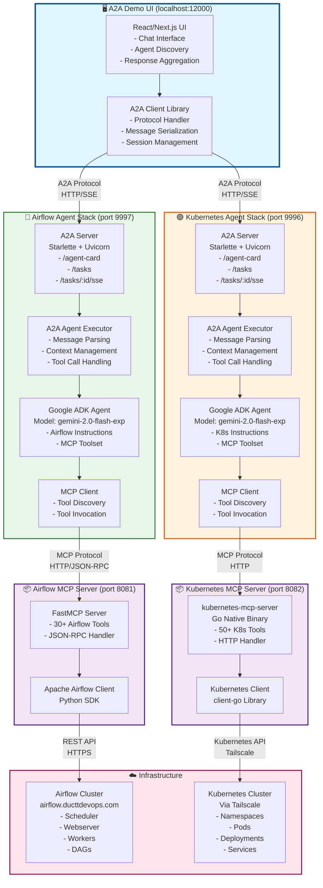
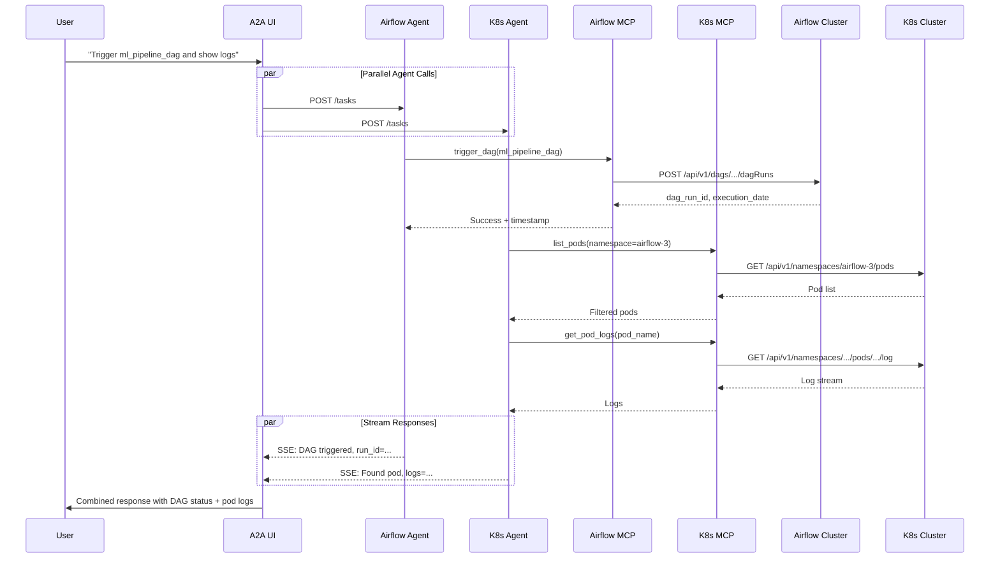

# A2A Multi-Agent Architecture

```mermaid
graph TB
    subgraph UI["🖥️ A2A Demo UI (localhost:12000)"]
        WebUI[React/Next.js UI<br/>- Chat Interface<br/>- Agent Discovery<br/>- Response Aggregation]
        A2AClient[A2A Client Library<br/>- Protocol Handler<br/>- Message Serialization<br/>- Session Management]
        WebUI --> A2AClient
    end

    subgraph AirflowStack["🔵 Airflow Agent Stack (port 9997)"]
        direction TB
        AirflowA2A[A2A Server<br/>Starlette + Uvicorn<br/>- /agent-card<br/>- /tasks<br/>- /tasks/:id/sse]
        AirflowExec[A2A Agent Executor<br/>- Message Parsing<br/>- Context Management<br/>- Tool Call Handling]
        AirflowADK[Google ADK Agent<br/>Model: gemini-2.0-flash-exp<br/>- Airflow Instructions<br/>- MCP Toolset]
        AirflowMCPClient[MCP Client<br/>- Tool Discovery<br/>- Tool Invocation]
        
        AirflowA2A --> AirflowExec
        AirflowExec --> AirflowADK
        AirflowADK --> AirflowMCPClient
    end

    subgraph K8sStack["🟢 Kubernetes Agent Stack (port 9996)"]
        direction TB
        K8sA2A[A2A Server<br/>Starlette + Uvicorn<br/>- /agent-card<br/>- /tasks<br/>- /tasks/:id/sse]
        K8sExec[A2A Agent Executor<br/>- Message Parsing<br/>- Context Management<br/>- Tool Call Handling]
        K8sADK[Google ADK Agent<br/>Model: gemini-2.0-flash-exp<br/>- K8s Instructions<br/>- MCP Toolset]
        K8sMCPClient[MCP Client<br/>- Tool Discovery<br/>- Tool Invocation]
        
        K8sA2A --> K8sExec
        K8sExec --> K8sADK
        K8sADK --> K8sMCPClient
    end

    subgraph AirflowMCP["📦 Airflow MCP Server (port 8081)"]
        direction TB
        AirflowMCPServer[FastMCP Server<br/>- 30+ Airflow Tools<br/>- JSON-RPC Handler]
        AirflowClient[Apache Airflow Client<br/>Python SDK]
        AirflowMCPServer --> AirflowClient
    end

    subgraph K8sMCP["📦 Kubernetes MCP Server (port 8082)"]
        direction TB
        K8sMCPServer[kubernetes-mcp-server<br/>Go Native Binary<br/>- 50+ K8s Tools<br/>- HTTP Handler]
        K8sClient[Kubernetes Client<br/>client-go Library]
        K8sMCPServer --> K8sClient
    end

    subgraph Infrastructure["☁️ Infrastructure"]
        AirflowCluster[Airflow Cluster<br/>airflow.ducttdevops.com<br/>- Scheduler<br/>- Webserver<br/>- Workers<br/>- DAGs]
        K8sCluster[Kubernetes Cluster<br/>Via Tailscale<br/>- Namespaces<br/>- Pods<br/>- Deployments<br/>- Services]
    end

    %% Connections
    A2AClient -->|"A2A Protocol<br/>HTTP/SSE"| AirflowA2A
    A2AClient -->|"A2A Protocol<br/>HTTP/SSE"| K8sA2A
    
    AirflowMCPClient -->|"MCP Protocol<br/>HTTP/JSON-RPC"| AirflowMCPServer
    K8sMCPClient -->|"MCP Protocol<br/>HTTP"| K8sMCPServer
    
    AirflowClient -->|"REST API<br/>HTTPS"| AirflowCluster
    K8sClient -->|"Kubernetes API<br/>Tailscale"| K8sCluster

    %% Styling
    classDef uiStyle fill:#e1f5ff,stroke:#01579b,stroke-width:3px
    classDef airflowStyle fill:#e8f5e9,stroke:#2e7d32,stroke-width:2px
    classDef k8sStyle fill:#fff3e0,stroke:#e65100,stroke-width:2px
    classDef mcpStyle fill:#f3e5f5,stroke:#4a148c,stroke-width:2px
    classDef infraStyle fill:#fce4ec,stroke:#880e4f,stroke-width:2px

    class UI uiStyle
    class AirflowStack airflowStyle
    class K8sStack k8sStyle
    class AirflowMCP,K8sMCP mcpStyle
    class Infrastructure infraStyle
```

## Message Flow

```mermaid
sequenceDiagram
    participant User
    participant UI as A2A UI
    participant AirflowAgent as Airflow Agent
    participant K8sAgent as K8s Agent
    participant AirflowMCP as Airflow MCP
    participant K8sMCP as K8s MCP
    participant Airflow as Airflow Cluster
    participant K8s as K8s Cluster

    User->>UI: "Trigger ml_pipeline_dag and show logs"
    
    par Parallel Agent Calls
        UI->>AirflowAgent: POST /tasks
        UI->>K8sAgent: POST /tasks
    end
    
    AirflowAgent->>AirflowMCP: trigger_dag(ml_pipeline_dag)
    AirflowMCP->>Airflow: POST /api/v1/dags/.../dagRuns
    Airflow-->>AirflowMCP: dag_run_id, execution_date
    AirflowMCP-->>AirflowAgent: Success + timestamp
    
    K8sAgent->>K8sMCP: list_pods(namespace=airflow-3)
    K8sMCP->>K8s: GET /api/v1/namespaces/airflow-3/pods
    K8s-->>K8sMCP: Pod list
    K8sMCP-->>K8sAgent: Filtered pods
    
    K8sAgent->>K8sMCP: get_pod_logs(pod_name)
    K8sMCP->>K8s: GET /api/v1/namespaces/.../pods/.../log
    K8s-->>K8sMCP: Log stream
    K8sMCP-->>K8sAgent: Logs
    
    par Stream Responses
        AirflowAgent-->>UI: SSE: DAG triggered, run_id=...
        K8sAgent-->>UI: SSE: Found pod, logs=...
    end
    
    UI->>User: Combined response with DAG status + pod logs
```
