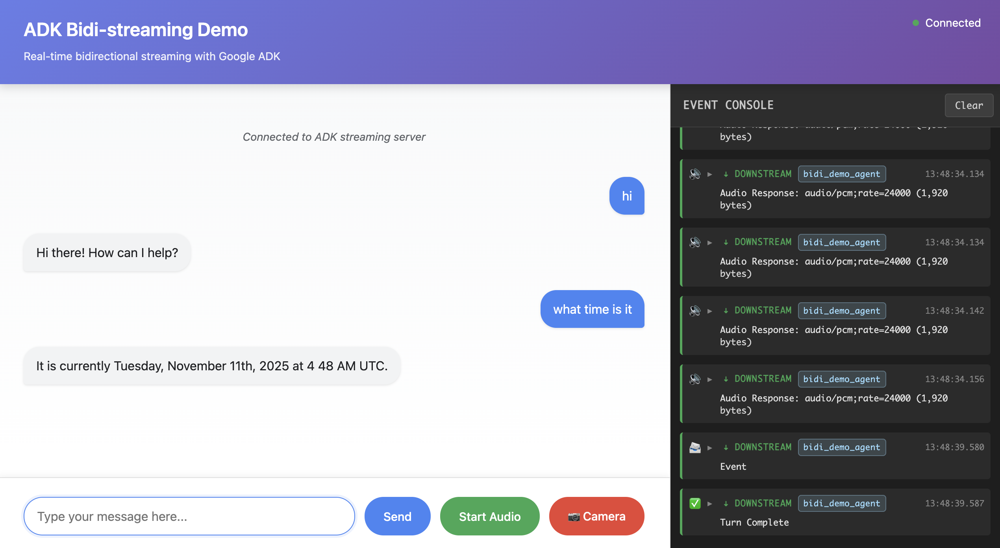

# ADK Bidi-streaming Demo

A working demonstration of real-time bidirectional streaming with Google's Agent Development Kit (ADK). This FastAPI application showcases WebSocket-based communication with Gemini models, supporting multimodal requests (text, audio, and image/video input) and flexible responses (text or audio output).



## Overview

This demo implements the complete ADK bidirectional streaming lifecycle:

1. **Application Initialization**: Creates `Agent`, `SessionService`, and `Runner` at startup
2. **Session Initialization**: Establishes `Session`, `RunConfig`, and `LiveRequestQueue` per connection
3. **Bidirectional Streaming**: Concurrent upstream (client → queue) and downstream (events → client) tasks
4. **Graceful Termination**: Proper cleanup of `LiveRequestQueue` and WebSocket connections

## Features

- **WebSocket Communication**: Real-time bidirectional streaming via `/ws/{user_id}/{session_id}`
- **Multimodal Requests**: Text, audio, and image/video input with automatic audio transcription
- **Flexible Responses**: Text or audio output, automatically determined based on model architecture
- **Session Resumption**: Reconnection support configured via `RunConfig`
- **Concurrent Tasks**: Separate upstream/downstream async tasks for optimal performance
- **Interactive UI**: Web interface with event console for monitoring Live API events
- **Google Search Integration**: Agent equipped with `google_search` tool

## Architecture

The application follows ADK's recommended concurrent task pattern:

```
┌─────────────┐         ┌──────────────────┐         ┌─────────────┐
│             │         │                  │         │             │
│  WebSocket  │────────▶│ LiveRequestQueue │────────▶│  Live API   │
│   Client    │         │                  │         │   Session   │
│             │◀────────│   run_live()     │◀────────│             │
└─────────────┘         └──────────────────┘         └─────────────┘
  Upstream Task              Queue              Downstream Task
```

- **Upstream Task**: Receives WebSocket messages and forwards to `LiveRequestQueue`
- **Downstream Task**: Processes `run_live()` events and sends to WebSocket client

## Prerequisites

- Python 3.10 or higher
- [uv](https://docs.astral.sh/uv/) (recommended) or pip
- Google API key (for Gemini Live API) or Google Cloud project (for Vertex AI Live API)

**Installing uv (if not already installed):**

```bash
# macOS/Linux
curl -LsSf https://astral.sh/uv/install.sh | sh

# Windows
powershell -ExecutionPolicy ByPass -c "irm https://astral.sh/uv/install.ps1 | iex"
```

## Installation

### 1. Navigate to Demo Directory

```bash
cd src/bidi-demo
```

### 2. Install Dependencies

**Using uv (recommended):**

```bash
uv sync
```

This automatically creates a virtual environment, installs all dependencies, and generates a lock file for reproducible builds.

**Using pip (alternative):**

```bash
python3 -m venv .venv
source .venv/bin/activate  # On Windows: .venv\Scripts\activate
pip install -e .
```

### 3. Configure Environment Variables

Create or edit `app/.env` with your credentials:

```bash
# Choose your Live API platform
GOOGLE_GENAI_USE_VERTEXAI=FALSE

# For Gemini Live API (when GOOGLE_GENAI_USE_VERTEXAI=FALSE)
GOOGLE_API_KEY=your_api_key_here

# For Vertex AI Live API (when GOOGLE_GENAI_USE_VERTEXAI=TRUE)
# GOOGLE_CLOUD_PROJECT=your_project_id
# GOOGLE_CLOUD_LOCATION=us-central1

# Model selection (optional, defaults to native audio model)
# See "Supported Models" section below for available model names
DEMO_AGENT_MODEL=gemini-2.5-flash-native-audio-preview-09-2025
```

#### Getting API Credentials

**Gemini Live API:**
1. Visit [Google AI Studio](https://aistudio.google.com/apikey)
2. Create an API key
3. Set `GOOGLE_API_KEY` in `.env`

**Vertex AI Live API:**
1. Enable Vertex AI API in [Google Cloud Console](https://console.cloud.google.com)
2. Set up authentication using `gcloud auth application-default login`
3. Set `GOOGLE_CLOUD_PROJECT` and `GOOGLE_CLOUD_LOCATION` in `.env`
4. Set `GOOGLE_GENAI_USE_VERTEXAI=TRUE`

### 4. Set SSL Certificate Path

Set the SSL certificate file path for secure connections:

```bash
# If using uv
export SSL_CERT_FILE=$(uv run python -m certifi)

# If using pip with activated venv
export SSL_CERT_FILE=$(python -m certifi)
```

## Running the Demo

### Start the Server

From the `src/bidi-demo` directory, first change to the `app` subdirectory:

```bash
cd app
```

> **Note:** You must run from inside the `app` directory so Python can find the `google_search_agent` module. Running from the parent directory will fail with `ModuleNotFoundError: No module named 'google_search_agent'`.

**Using uv (recommended):**

```bash
uv run --project .. uvicorn main:app --reload --host 0.0.0.0 --port 8000
```

**Using pip (with activated venv):**

```bash
uvicorn main:app --reload --host 0.0.0.0 --port 8000
```

The `--reload` flag enables auto-restart on code changes during development.

#### Background Mode (Testing/Production)

To run in background with log output:

```bash
# Using uv (from app directory)
uv run --project .. uvicorn main:app --host 0.0.0.0 --port 8000 > server.log 2>&1 &

# Using pip (from app directory)
uvicorn main:app --host 0.0.0.0 --port 8000 > server.log 2>&1 &
```

To check the server log:

```bash
tail -f server.log  # Follow log in real-time
```

To stop the background server:

```bash
kill $(lsof -ti:8000)
```

### Access the Application

Open your browser and navigate to:

```
http://localhost:8000
```

## Usage

### Text Mode

1. Type your message in the input field
2. Click "Send" or press Enter
3. Watch the event console for Live API events
4. Receive streamed responses in real-time

### Audio Mode

1. Click "Start Audio" to begin voice interaction
2. Speak into your microphone
3. Receive audio responses with real-time transcription
4. Click "Stop Audio" to end the audio session

## WebSocket API

### Endpoint

```
ws://localhost:8000/ws/{user_id}/{session_id}
```

**Path Parameters:**
- `user_id`: Unique identifier for the user
- `session_id`: Unique identifier for the session

**Response Modality:**
- Automatically determined based on model architecture
- Native audio models use AUDIO response modality
- Half-cascade models use TEXT response modality

### Message Format

**Client → Server (Text):**
```json
{
  "type": "text",
  "text": "Your message here"
}
```

**Client → Server (Image):**
```json
{
  "type": "image",
  "data": "base64_encoded_image_data",
  "mimeType": "image/jpeg"
}
```

**Client → Server (Audio):**
- Send raw binary frames (PCM audio, 16kHz, 16-bit)

**Server → Client:**
- JSON-encoded ADK `Event` objects
- See [ADK Events Documentation](https://google.github.io/adk-docs/) for event schemas

## Project Structure

```
bidi-demo/
├── app/
│   ├── google_search_agent/      # Agent definition module
│   │   ├── __init__.py           # Package exports
│   │   └── agent.py              # Agent configuration
│   ├── main.py                   # FastAPI application and WebSocket endpoint
│   ├── .env                      # Environment configuration (not in git)
│   └── static/                   # Frontend files
│       ├── index.html            # Main UI
│       ├── css/
│       │   └── style.css         # Styling
│       └── js/
│           ├── app.js                    # Main application logic
│           ├── audio-player.js           # Audio playback
│           ├── audio-recorder.js         # Audio recording
│           ├── pcm-player-processor.js   # Audio processing
│           └── pcm-recorder-processor.js # Audio processing
├── tests/                        # E2E tests and test logs
├── pyproject.toml               # Python project configuration
└── README.md                    # This file
```

## Code Overview

### Agent Definition (app/google_search_agent/agent.py)

The agent is defined in a separate module following ADK best practices:

```python
agent = Agent(
    name="google_search_agent",
    model=os.getenv("DEMO_AGENT_MODEL", "gemini-2.5-flash-native-audio-preview-09-2025"),
    tools=[google_search],
    instruction="You are a helpful assistant that can search the web."
)
```

### Application Initialization (app/main.py:37-50)

```python
from google_search_agent.agent import agent

app = FastAPI()
session_service = InMemorySessionService()
runner = Runner(app_name="bidi-demo", agent=agent, session_service=session_service)
```

### WebSocket Handler (app/main.py:65-209)

The WebSocket endpoint implements the complete bidirectional streaming pattern:

1. **Accept Connection**: Establish WebSocket connection
2. **Configure Session**: Create `RunConfig` with automatic modality detection
3. **Initialize Queue**: Create `LiveRequestQueue` for message passing
4. **Start Concurrent Tasks**: Launch upstream and downstream tasks
5. **Handle Cleanup**: Close queue in `finally` block

### Concurrent Tasks

**Upstream Task** (app/main.py:125-172):
- Receives WebSocket messages (text, image, or audio binary)
- Converts to ADK format (`Content` or `Blob`)
- Sends to `LiveRequestQueue` via `send_content()` or `send_realtime()`

**Downstream Task** (app/main.py:174-187):
- Calls `runner.run_live()` with queue and config
- Receives `Event` stream from Live API
- Serializes events to JSON and sends to WebSocket

## Configuration

### Supported Models

The demo supports any Gemini model compatible with Live API:

**Native Audio Models** (recommended for voice):
- `gemini-2.5-flash-native-audio-preview-09-2025` (Gemini Live API)
- `gemini-live-2.5-flash-preview-native-audio-09-2025` (Vertex AI)

Set the model via `DEMO_AGENT_MODEL` in `.env` or modify `app/google_search_agent/agent.py`.

For the latest model availability and features:
- **Gemini Live API**: Check the [official Gemini API models documentation](https://ai.google.dev/gemini-api/docs/models)
- **Vertex AI Live API**: Check the [official Vertex AI models documentation](https://cloud.google.com/vertex-ai/generative-ai/docs/learn/models)

### RunConfig Options

The demo automatically configures bidirectional streaming based on model architecture (app/main.py:76-104):

**For Native Audio Models** (containing "native-audio" in model name):
```python
run_config = RunConfig(
    streaming_mode=StreamingMode.BIDI,
    response_modalities=["AUDIO"],
    input_audio_transcription=types.AudioTranscriptionConfig(),
    output_audio_transcription=types.AudioTranscriptionConfig(),
    session_resumption=types.SessionResumptionConfig()
)
```

**For Half-Cascade Models** (other models):
```python
run_config = RunConfig(
    streaming_mode=StreamingMode.BIDI,
    response_modalities=["TEXT"],
    input_audio_transcription=None,
    output_audio_transcription=None,
    session_resumption=types.SessionResumptionConfig()
)
```

The modality detection is automatic based on the model name. Native audio models use AUDIO response modality with transcription enabled, while half-cascade models use TEXT response modality for better performance.

## Troubleshooting

### Connection Issues

**Problem**: WebSocket fails to connect

**Solutions**:
- Verify API credentials in `app/.env`
- Check console for error messages
- Ensure uvicorn is running on correct port

### Audio Not Working

**Problem**: Audio input/output not functioning

**Solutions**:
- Grant microphone permissions in browser
- Verify browser supports Web Audio API
- Check that audio model is configured (native audio model required)
- Review browser console for errors

### Model Errors

**Problem**: "Model not found" or quota errors

**Solutions**:
- Verify model name matches your platform (Gemini vs Vertex AI)
- Check API quota limits in console
- Ensure billing is enabled (for Vertex AI)

## Development

### Code Formatting

This project uses black, isort, and flake8 for code formatting and linting. Configuration is inherited from the repository root.

**Using uv:**

```bash
uv run black .
uv run isort .
uv run flake8 .
```

**Using pip (with activated venv):**

```bash
black .
isort .
flake8 .
```

To check formatting without making changes:

```bash
# Using uv
uv run black --check .
uv run isort --check .

# Using pip
black --check .
isort --check .
```

## Additional Resources

- **ADK Documentation**: https://google.github.io/adk-docs/
- **Gemini Live API**: https://ai.google.dev/gemini-api/docs/live
- **Vertex AI Live API**: https://cloud.google.com/vertex-ai/generative-ai/docs/live-api
- **ADK GitHub Repository**: https://github.com/google/adk-python

## License

Apache 2.0 - See repository LICENSE file for details.
