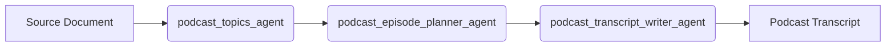

# Podcast Transcript Agent

**The Podcast Transcript Agent is a powerful tool that automates the creation of podcast transcripts from any PDF, Markdown, or Text document.** By leveraging a series of specialized AI agents, it can take a source document and generate a complete, conversational podcast transcript.

## Agent Details

The Podcast Transcript Agent is a sequential agent that orchestrates a series of sub-agents to perform the task of generating a podcast transcript. It takes a user-provided document and guides it through a pipeline of three specialized agents:

1.  **Podcast Topics Agent**: Extracts the key topics and information from the source document.
2.  **Podcast Episode Planner Agent**: Structures the extracted information into a coherent podcast episode plan.
3.  **Podcast Transcript Writer Agent**: Writes a full conversational script based on the episode plan.

## Agent Architecture

The Podcast Transcript Agent operates as a sequential process, where each step is handled by a dedicated sub-agent. The output of one agent becomes the input for the next, ensuring a smooth and logical workflow from topic extraction to the final script.



## Key Features

*   **Automated Content Repurposing**: Transform existing documents (PDFs, text files) into engaging podcast episodes.
*   **Conversational Script Generation**: Creates natural-sounding dialogue between a host and an expert persona.
*   **Structured Episode Planning**: Automatically generates a well-structured episode plan with an introduction, main segments, and a conclusion.
*   **Customizable Personas**: Easily define the names and roles of the podcast host and expert.
*   **Extensible Architecture**: The sequential nature of the agent makes it easy to add new steps or modify existing ones.

## Setup and Installation

### Prerequisites

*   Python 3.13 or higher
*   An active Google Gemini API key or a configured Google Cloud project with Vertex AI enabled.

### 1. Clone the Repository

```bash
git clone https://github.com/google/adk-samples.git
cd adk-samples/python/agents/podcast_transcript_agent
```

### 2. Create a Virtual Environment

```bash
python3 -m venv .venv
source .venv/bin/activate
```

### 3. Install Dependencies

This project uses `uv` to manage dependencies. `uv` is an extremely fast Python package installer and resolver. It provides a more efficient and reliable way to manage your project's dependencies.

To install the dependencies, run the following command:

```bash
uv sync
```

### 4. Configure Environment Variables

Create a `.env` file in the root of the project and add the following configuration for Vertex AI Authentication:

```
GOOGLE_GENAI_USE_VERTEXAI=TRUE
GOOGLE_CLOUD_PROJECT="your-gcp-project-id"
GOOGLE_CLOUD_LOCATION="your-gcp-region"
```

If you are using Vertex AI, make sure you are authenticated with `gcloud`:

```bash
gcloud auth application-default login
```

## Running the Agent

You can run the agent in two ways: through the interactive web interface or as a standalone API server.

### Using the ADK Web Interface

The web interface provides a user-friendly way to interact with the agent.

To start the web interface, run the following command from the root of the project:

```bash
adk web
```

This will start a local server and open a web browser with the agent's user interface.

#### Uploading Files

The web interface allows you to easily upload PDF and text files to the agent.

1.  In the chat interface, you will see a paperclip icon for attachments.
2.  Click the paperclip icon to open a file dialog.
3.  Select the PDF or text file you want to use to generate the podcast transcript.
4.  The file will be uploaded and sent to the agent along with your prompt.

### Using the ADK API Server

You can also run the agent as a standalone API server. This is useful for programmatic access or for integrating the agent into other applications.

To start the API server, run the following command:

```bash
adk api-server
```

This will start a local server at `http://localhost:8000`.

#### Example Interaction

You can interact with the running API server using the provided shell scripts in the `tests` directory.

**Example with a text file:**

```bash
./tests/run_with_txt.sh
```

This script sends the content of `tests/test_artifacts/test_pyramid.txt` to the agent and saves the agent's response in `test_response.json`.

## Testing

To run the included tests, use `pytest`:

```bash
.venv/bin/pytest
```

## Customization

This agent is designed to be easily customizable:

*   **Prompts**: You can modify the prompts for each sub-agent to change the style and tone of the generated podcast.
*   **Personas**: The host and expert personas can be changed by modifying the prompt in the `podcast_transcript_writer_agent`.
*   **Sub-Agents**: You can add new sub-agents to the sequence to perform additional tasks, such as generating show notes or social media posts.

## Troubleshooting

*   **Authentication Errors**: Ensure that your API key or Vertex AI environment variables are correctly set in the `.env` file.
*   **Dependency Issues**: Make sure you have installed all the required dependencies from `requirements.txt` in your virtual environment.
*   **File Not Found**: The example scripts use relative paths. Make sure you are running them from the root of the `podcast_transcript_agent` directory.
